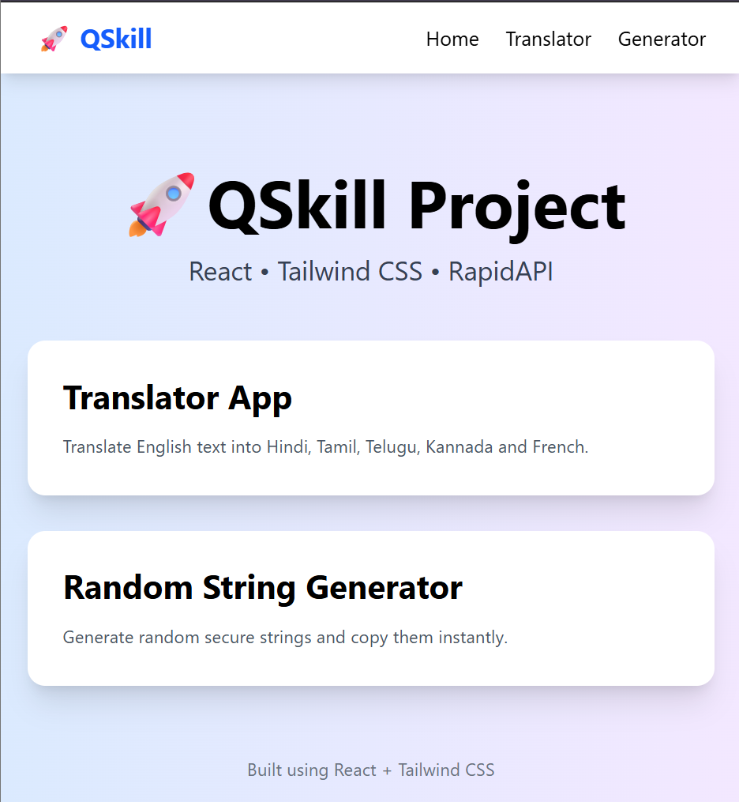

# 🚀 QSkill Internship Project

## 📌 Project Overview

This project was developed as part of the **QSkill Front-End Development Internship** using:

* React JS
* Tailwind CSS
* React Router DOM
* RapidAPI

The project contains two mini applications:

1. 🌍 Text Translator App
2. 🔑 Random String Generator

---

# 🛠️ Technologies Used

* React JS
* Tailwind CSS
* React Router DOM
* RapidAPI
* JavaScript (ES6+)
* HTML5
* CSS3

---

# 🌍 Translator App

### Features

* Convert English text into multiple languages
* Supports:

  * Hindi
  * Tamil
  * Telugu
  * Kannada
  * French
* Uses RapidAPI Translation Service
* Copy translated text
* Responsive UI

### React Concepts Used

* useState
* Async/Await
* API Integration
* Event Handling

---

# 🔑 Random String Generator

### Features

* Generate random strings
* User-controlled string length
* Copy generated string
* Responsive UI

### React Concepts Used

* useState
* useCallback
* useEffect

---

# 🧭 Routing

Implemented client-side routing using:

* React Router DOM

Routes:

| Route       | Description             |
| ----------- | ----------------------- |
| /           | Home Page               |
| /translator | Translator App          |
| /generator  | Random String Generator |

---

# 📂 Project Structure

src/
│
├── components/
│ └── Navbar.jsx
│
├── pages/
│ ├── Home.jsx
│ ├── Translator.jsx
│ └── Generator.jsx
│
├── App.jsx
├── main.jsx
└── index.css

---

# 🚀 Installation

Clone Repository

git clone https://github.com/imRvarma/Qskill-internship-project.git

Install Dependencies

npm install

Run Project

npm run dev

---

## 📸 Project Screenshots

### 🏠 Home Page

---

# 👨‍💻 Developed By

Rahul Kumar

QSkill Front-End Development Internship 2026
